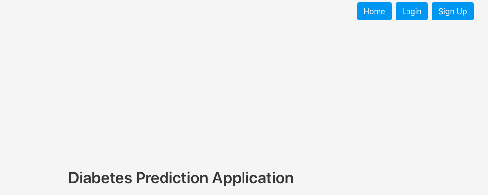
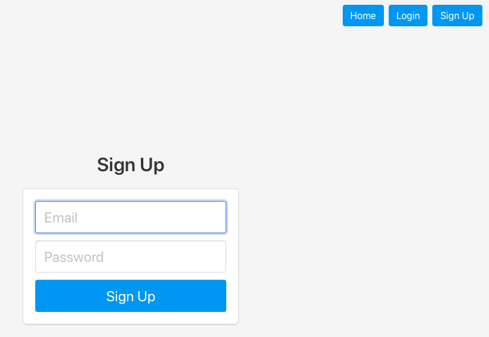
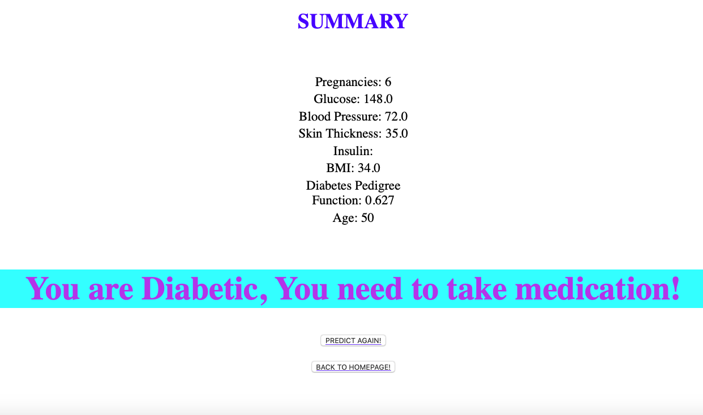

# Diabetic-Prediction-Application

This is a diabetic prediction application using signup an payment functionality.

## The Solution

- The diabetic prediction model is calculated using prima india diabetes dataset. The notebook for the ML model 

https://github.com/jayant2014/Diabetic-Prediction-Application/blob/master/Diabetes.ipynb

- This is a webapp integrated with login functionality which validats the user and allows for prediction. This application is based in firebase auth engine.

- This application is linked with stripe payment system with test keys only.

- The application is run by executing run.py and can be browsed through web using http:127.0.0.1:5000

## Screenshots

## Homepage

## Login Page

## Signup Page

## Predict data entry Page

## Prediction with non-diabetic condition

## Prediction with diabetic condition

